# NuGet Package Setup for Bannou Client SDK

## Package Configuration

### **Recommended Package ID**
```
BeyondImmersion.Bannou.Client.SDK
```

### **API Key Scope Pattern** 
When creating your NuGet API key, use this glob pattern for security:
```
BeyondImmersion.Bannou.*
```

This allows publishing any package under the `BeyondImmersion.Bannou` namespace while preventing accidental publishing to other namespaces.

## GitHub Environment Secrets Setup

**Environment-Specific Security**: NuGet publishing is restricted to the `production` environment for enhanced security.

### Production Environment Setup
1. Go to your GitHub repository → **Settings** → **Environments**
2. Create environment named: `production`
3. Configure deployment restrictions:
   - ✅ **Required reviewers** (optional): Add team members for manual approval
   - ✅ **Deployment branches**: Restrict to `master` branch only
   - ✅ **Environment protection rules**: Enable to prevent accidental publishing

### Environment Secrets
Add the following secret to your **production environment**:

**Secret Name**: `NUGET_API_KEY`  
**Secret Value**: `[Your NuGet API Key from nuget.org]`  
**Scope**: Production environment only

### Steps to get API Key:
1. Go to https://www.nuget.org/account/apikeys
2. Click "Create" 
3. **Key Name**: `Bannou-Client-SDK-CI`
4. **Glob Pattern**: `BeyondImmersion.Bannou.*`  
5. **Select Scopes**: ✅ Push new packages and package versions
6. Copy the generated key to GitHub Secrets

## Package Metadata

The generated SDK will use these NuGet package properties:

```xml
<PackageId>BeyondImmersion.Bannou.Client.SDK</PackageId>
<Authors>BeyondImmersion</Authors>
<Description>Client SDK for Bannou service platform with generated service clients, models, and WebSocket protocol support</Description>
<PackageTags>bannou;microservices;websocket;dapr;client;sdk</PackageTags>
<PackageLicenseExpression>MIT</PackageLicenseExpression>
<PackageProjectUrl>https://github.com/BeyondImmersion/bannou</PackageProjectUrl>
<RepositoryUrl>https://github.com/BeyondImmersion/bannou</RepositoryUrl>
```

## Version Management

- **Automatic Versioning**: Uses semantic versioning via git tags
- **Pre-release Versions**: Development builds get `-preview` suffix
- **Stable Versions**: Only master branch creates stable releases
- **Version Format**: `1.0.0`, `1.0.1-preview.1`, etc.

## Enhanced Publishing Workflow

```mermaid
graph TD
    A[Commit to master] --> B[1️⃣ Generate Services]
    B --> C[2️⃣ Generate SDK]
    C --> D[3️⃣ Build All Projects]
    D --> E[4️⃣ Generate Services Again]
    E --> F[5️⃣ Generate SDK Again]
    F --> G[6️⃣ Unit Tests]
    G --> H[7️⃣ Infrastructure Tests]
    H --> I[8️⃣ HTTP Integration Tests]
    I --> J[9️⃣ WebSocket Tests - Published SDK]
    J --> K[🔟 WebSocket Tests - Current SDK]
    K --> L{Production Environment}
    L -->|Authorized| M[Calculate Version]
    M --> N[Pack NuGet]
    N --> O[Publish to NuGet.org]
    O --> P[Available for consumption]
    L -->|Unauthorized| Q[Skip Publishing]
```



## Installation for Consumers

Once published, developers can install with:

```bash
dotnet add package BeyondImmersion.Bannou.Client.SDK
```

Or in PackageReference:
```xml
<PackageReference Include="BeyondImmersion.Bannou.Client.SDK" Version="*" />
```

## Security Considerations

- ✅ **Environment Restrictions**: Publishing only allowed from `production` environment
- ✅ **Branch Protection**: Only `master` branch can trigger publishing
- ✅ **Scoped API Key**: Limited to `BeyondImmersion.Bannou.*` namespace
- ✅ **Environment Secrets**: API key scoped to production environment only
- ✅ **MIT License**: Compatible with open source distribution  
- ✅ **Automated Only**: No manual publishing reduces human error
- ✅ **Backwards Compatibility**: Automated testing with published SDK versions

## Testing the Setup

To test your NuGet configuration locally:

```bash
# Generate SDK
./generate-client-sdk.sh

# Build and pack
dotnet pack Bannou.Client.SDK --configuration Release -p:PackageVersion=1.0.0-test --output ./test-packages

# Test publish (dry run)
dotnet nuget push ./test-packages/*.nupkg --api-key YOUR_API_KEY --source https://api.nuget.org/v3/index.json --dry-run
```

## Package Content

The NuGet package will include:
- ✅ **Generated Service Clients** (`AccountsClient`, `AuthClient`, etc.)
- ✅ **Request/Response Models** (all POCO types from schemas)
- ✅ **WebSocket Protocol Support** (binary message handling)
- ✅ **Multi-target Support** (.NET 6, 8, 9)
- ✅ **XML Documentation** (IntelliSense support)
- ✅ **Source Link** (debugging support)
