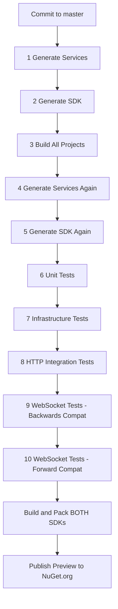

# NuGet Package Setup for Bannou SDKs

## Dual SDK Architecture

Bannou publishes **two SDK packages** to NuGet for different use cases:

### **Server SDK** (`BeyondImmersion.Bannou.SDK`)
For **game servers** that need service-to-service calls AND WebSocket support.

**Includes:**
- Service Clients (`AccountClient`, `AuthClient`, etc.) for mesh invocation
- Request/Response Models from all services
- Event Models for pub/sub messaging
- WebSocket Binary Protocol (31-byte header)
- `BannouClient.cs` for WebSocket connections
- Infrastructure abstractions (lib-mesh, lib-messaging, lib-state)

**Dependencies:** `System.Net.WebSockets.Client`, infrastructure lib references

### **Client SDK** (`BeyondImmersion.Bannou.Client`)
For **game clients** that ONLY communicate via WebSocket (no server infrastructure).

**Includes:**
- Request/Response Models from all services
- Event Models for pub/sub messaging
- WebSocket Binary Protocol (31-byte header)
- `BannouClient.cs` for WebSocket connections

**Dependencies:** `System.Net.WebSockets.Client` (no server infrastructure)

**What's NOT Included:**
- Service Clients (use `Bannou.SDK` if you need these)
- Server infrastructure libs

## Package Configuration

### **API Key Scope Pattern**
When creating your NuGet API key, use this glob pattern for security:
```
BeyondImmersion.Bannou.*
```

This allows publishing both SDK packages while preventing accidental publishing to other namespaces.

## GitHub Environment Secrets Setup

**Environment-Specific Security**: NuGet publishing is restricted to the `production` environment for enhanced security.

### Production Environment Setup
1. Go to your GitHub repository → **Settings** → **Environments**
2. Create environment named: `production`
3. Configure deployment restrictions:
   - **Required reviewers** (optional): Add team members for manual approval
   - **Deployment branches**: Restrict to `master` branch only
   - **Environment protection rules**: Enable to prevent accidental publishing

### Environment Secrets
Add the following secret to your **production environment**:

**Secret Name**: `NUGET_API_KEY`
**Secret Value**: `[Your NuGet API Key from nuget.org]`
**Scope**: Production environment only

### Steps to get API Key:
1. Go to https://www.nuget.org/account/apikeys
2. Click "Create"
3. **Key Name**: `Bannou-SDK-CI`
4. **Glob Pattern**: `BeyondImmersion.Bannou.*`
5. **Select Scopes**: Push new packages and package versions
6. Copy the generated key to GitHub Secrets

## Package Metadata

### Server SDK
```xml
<PackageId>BeyondImmersion.Bannou.SDK</PackageId>
<Authors>BeyondImmersion</Authors>
<Description>Server SDK for Bannou service platform with service clients, models, events, and WebSocket protocol support. Use this for game servers and internal services.</Description>
<PackageTags>bannou;microservices;websocket;server;sdk;service-client</PackageTags>
```

### Client SDK
```xml
<PackageId>BeyondImmersion.Bannou.Client</PackageId>
<Authors>BeyondImmersion</Authors>
<Description>Client SDK for Bannou service platform with models, events, and WebSocket protocol support. For game clients - lightweight with no server infrastructure.</Description>
<PackageTags>bannou;microservices;websocket;client;sdk;game-client</PackageTags>
```

## Version Management

- **Automatic Versioning**: Uses semantic versioning via git tags
- **Pre-release Versions**: CI builds get `-preview.N` suffix (e.g., `0.1.0-preview.123`)
- **Stable Versions**: Manual release workflow creates stable versions
- **Version Format**: `1.0.0`, `0.1.0-preview.123`, etc.
- **Both SDKs share the same version number** for consistency

### Backwards Compatibility Testing
- Testing uses `Version="*"` to match **stable versions only**
- Preview versions are NOT used for backwards compatibility testing
- Backwards compat testing activates after first stable release (e.g., `1.0.0`)

## Publishing Workflow



## Installation for Consumers

### For Game Servers (with service mesh)
```bash
dotnet add package BeyondImmersion.Bannou.SDK
```

### For Game Clients (WebSocket only)
```bash
dotnet add package BeyondImmersion.Bannou.Client
```

### PackageReference Format
```xml
<!-- Server SDK -->
<PackageReference Include="BeyondImmersion.Bannou.SDK" Version="*" />

<!-- Client SDK -->
<PackageReference Include="BeyondImmersion.Bannou.Client" Version="*" />
```

## Security Considerations

- **Environment Restrictions**: Publishing only allowed from `production` environment
- **Branch Protection**: Only `master` branch can trigger publishing
- **Scoped API Key**: Limited to `BeyondImmersion.Bannou.*` namespace
- **Environment Secrets**: API key scoped to production environment only
- **MIT License**: Compatible with open source distribution
- **Automated Only**: No manual publishing reduces human error
- **Backwards Compatibility**: Automated testing with published SDK versions (stable only)

## Testing the Setup

To test your NuGet configuration locally:

```bash
# Generate both SDKs
scripts/generate-client-sdk.sh

# Build and pack Server SDK
dotnet pack Bannou.SDK --configuration Release -p:PackageVersion=1.0.0-test --output ./test-packages

# Build and pack Client SDK
dotnet pack Bannou.Client.SDK --configuration Release -p:PackageVersion=1.0.0-test --output ./test-packages

# Test publish (dry run)
dotnet nuget push ./test-packages/*.nupkg --api-key YOUR_API_KEY --source https://api.nuget.org/v3/index.json --dry-run
```

## Package Content Comparison

| Content | Server SDK | Client SDK |
|---------|------------|------------|
| Service Clients (`*Client.cs`) | Yes | **No** |
| Request/Response Models | Yes | Yes |
| Event Models | Yes | Yes |
| WebSocket Binary Protocol | Yes | Yes |
| `BannouClient.cs` | Yes | Yes |
| Infrastructure Libs | Yes | **No** |
| Multi-target (.NET 6, 8, 9) | Yes | Yes |
| XML Documentation | Yes | Yes |
